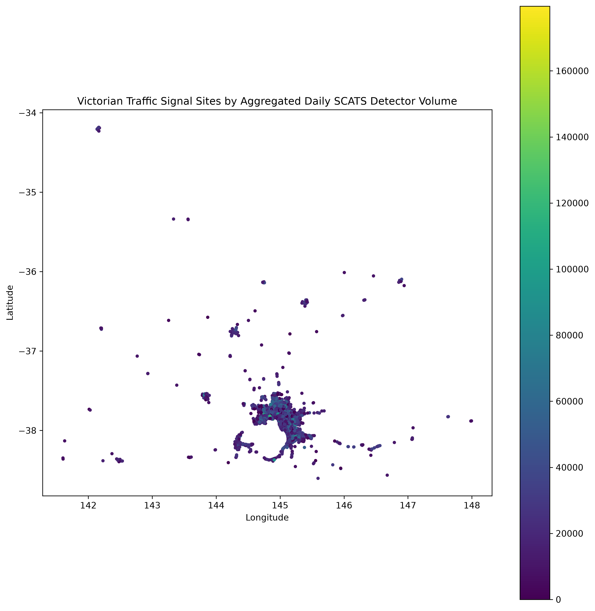
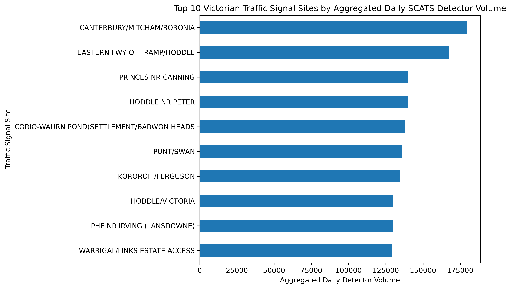

# Victorian Traffic Signal & SCATS Volume Analysis

**Python | Pandas | GeoPandas | Matplotlib | GeoJSON | Jupyter**

A geospatial data analysis project combining Victorian traffic signal locations with SCATS traffic volume data to identify and visualise high-volume traffic signal sites.

## Project Objective

The objective of this project is to answer:

> Which Victorian traffic signal sites recorded the highest aggregated SCATS detector volumes on 1 September 2026, and where are they located?

The project demonstrates how traffic and geospatial datasets can be cleaned, aggregated, joined and visualised using Python.

## Tools & Technologies

- Python
- Pandas
- GeoPandas
- Matplotlib
- Jupyter Notebook
- GeoJSON
- Git / GitHub

## Data

Two Victorian transport datasets are used:

1. **Traffic Signal Locations**  
   Contains traffic signal site identifiers, names, municipalities, latitude and longitude.

2. **SCATS Traffic Volume Data — 1 September 2026**  
   Contains detector-level traffic volume records for SCATS sites.

SCATS detector volumes are aggregated to site level before being joined with the traffic signal location data.

## Analysis Workflow

1. Load and inspect the traffic signal and SCATS datasets.
2. Remove traffic signal records without valid Victorian coordinates.
3. Exclude negative reported daily detector-volume values from volume aggregation.
4. Aggregate detector-level traffic volumes by SCATS site.
5. Convert signal coordinates into GeoPandas Point geometries using WGS 84.
6. Join traffic volumes with signal locations using the common site identifier.
7. Rank sites by aggregated daily detector volume.
8. Visualise the results geographically and with a Top 10 comparison.
9. Export the processed spatial dataset as GeoJSON.

## Key Results

- 5,066 traffic signal records were loaded.
- 119,144 SCATS detector records were analysed.
- 4,510 traffic signal sites were successfully matched with SCATS volume data and geographic coordinates.
- **Canterbury/Mitcham/Boronia** recorded the highest aggregated daily detector volume in the analysed dataset at **179,582**.
- **Eastern Freeway Off Ramp/Hoddle** ranked second at **167,684**.

The results represent aggregated SCATS detector activity and should not be interpreted as unique vehicle counts or direct measurements of congestion.

## Visualisations

### Victorian Traffic Signal Volume Map

The map below shows the geographic distribution of matched Victorian traffic signal sites. Colour represents the aggregated daily SCATS detector volume recorded at each site.



### Top 10 Traffic Signal Sites

The chart below compares the ten traffic signal sites with the highest aggregated daily SCATS detector volumes on 1 September 2026.




## Project Structure

```text
vic_smart_traffic_analysis/
├── notebooks/
│   └── 02_traffic_analysis.ipynb
├── outputs/
│   ├── victorian_traffic_volume.geojson
│   └── figures/
│       ├── top_10_traffic_sites.png
│       └── victorian_traffic_volume_map.png
├── README.md
├── requirements.txt
└── .gitignore
